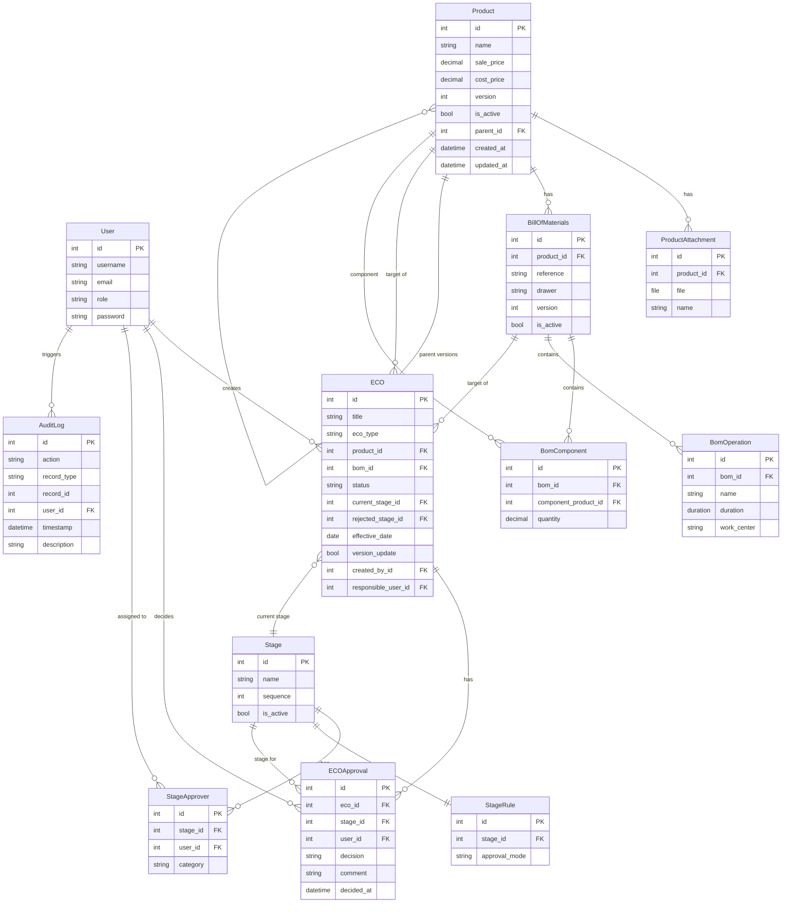
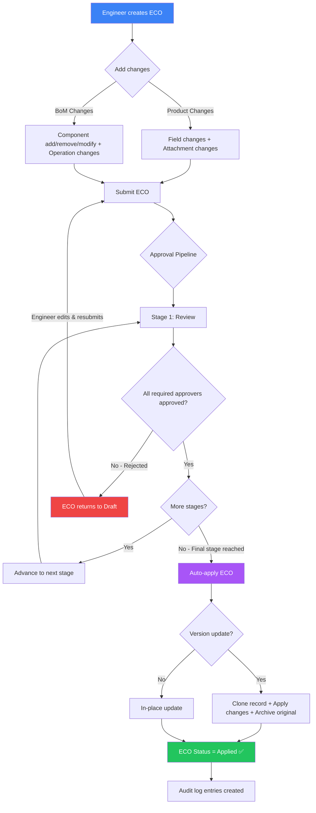

<p align="center">
  
  
  
  
  
  
</p>

# 🔺 DeltaPLM

**A full-stack Product Lifecycle Management (PLM) system for managing products, bills of materials, and engineering change orders — with role-based access control, configurable multi-stage approval workflows, version control, comprehensive audit logging, and executive reports.**

> Built as a hackathon project (24-hour challenge), DeltaPLM demonstrates a complete, production-grade PLM architecture with a Django REST API backend and a modern React single-page application frontend.

---

## 📑 Table of Contents

- [Overview](#-overview)
- [Key Features](#-key-features)
- [Architecture](#-architecture)
- [Tech Stack](#-tech-stack)
- [Project Structure](#-project-structure)
- [Getting Started](#-getting-started)
  - [Prerequisites](#prerequisites)
  - [Backend Setup](#1-backend-setup)
  - [Frontend Setup](#2-frontend-setup)
  - [Running the Application](#3-running-the-application)
- [Seed Data & Demo Accounts](#-seed-data--demo-accounts)
- [User Roles & Permissions](#-user-roles--permissions)
- [Module Documentation](#-module-documentation)
  - [Accounts (Authentication & RBAC)](#1-accounts--authentication--rbac)
  - [Master Data (Products & BoMs)](#2-master-data--products--boms)
  - [ECO Engine (Engineering Change Orders)](#3-eco-engine--engineering-change-orders)
  - [Approval Workflow & Stages](#4-approval-workflow--stages)
  - [Audit Log](#5-audit-log)
  - [Reports & Dashboard](#6-reports--dashboard)
- [API Reference](#-api-reference)
- [Frontend Pages & Components](#-frontend-pages--components)
- [Data Model (ER Diagram)](#-data-model-er-diagram)
- [ECO Lifecycle Flowchart](#-eco-lifecycle-flowchart)
- [Configuration](#-configuration)
- [Contributing](#-contributing)
- [License](#-license)

---

## 🌟 Overview

DeltaPLM is a **Product Lifecycle Management** system designed for engineering teams to manage:

- **Products** — Track items with pricing, versioning, and file attachments.
- **Bills of Materials (BoMs)** — Define product compositions (components & manufacturing operations).
- **Engineering Change Orders (ECOs)** — Propose, review, approve, and apply changes to products and BoMs through a controlled workflow.

The system enforces **strict change control**: once products and BoMs are created, direct editing is blocked. All modifications must go through ECOs, ensuring full traceability and compliance.

---

## ✨ Key Features

| Category | Feature |
|---|---|
| **Authentication** | JWT-based login/signup with automatic token refresh |
| **Role-Based Access** | 4 roles (Engineering, Approver, Operations, Admin) with granular permissions |
| **Product Management** | Create products with pricing, file attachments, and version history |
| **Bill of Materials** | Multi-level BoMs with components, quantities, and manufacturing operations |
| **Engineering Change Orders** | Full ECO lifecycle — draft, submit, approve/reject, apply |
| **Approval Workflow** | Admin-configurable multi-stage approval pipeline with required/optional approvers |
| **Version Control** | Automatic versioning with clone-on-write; version comparison & rollback |
| **Change Diffs** | Visual side-by-side comparison of what an ECO will change |
| **Audit Trail** | Every create, update, archive, approval, and rejection is logged |
| **Executive Reports** | Dashboard summary, ECO analytics, product version history, BoM changes, active matrix |
| **Attachment Management** | Upload/remove file attachments via ECOs with tracked changes |
| **Protected Master Data** | Direct PUT/PATCH/DELETE on products and BoMs is blocked — changes flow through ECOs only |

---

## 🏗 Architecture

```
┌──────────────────────────────────────────────────────────┐
│                      FRONTEND                            │
│              React 19 + Vite 8 + Tailwind 4              │
│            ShadCN UI + React Router + Axios               │
│                                                          │
│  ┌──────────┐ ┌──────────┐ ┌──────┐ ┌────────┐ ┌──────┐ │
│  │Dashboard │ │ Products │ │ BoMs │ │  ECOs  │ │Reports│ │
│  └────┬─────┘ └────┬─────┘ └──┬───┘ └───┬────┘ └──┬───┘ │
│       └─────────────┴──────────┴─────────┴─────────┘     │
│                         │                                │
│                    Axios Client                          │
│              (JWT auto-attach & refresh)                 │
└─────────────────────────┬────────────────────────────────┘
                          │ HTTP (Vite proxy → :8000)
┌─────────────────────────┴────────────────────────────────┐
│                       BACKEND                            │
│           Django 5 + Django REST Framework                │
│                                                          │
│  ┌──────────┐ ┌───────────┐ ┌─────┐ ┌──────┐ ┌────────┐ │
│  │ accounts │ │masterdata │ │ eco │ │audits│ │reports │ │
│  │(Auth/JWT)│ │(Prod/BoM) │ │(ECO)│ │(Log) │ │(Views) │ │
│  └──────────┘ └───────────┘ └─────┘ └──────┘ └────────┘ │
│                                                          │
│                   PostgreSQL (prod)                       │
└──────────────────────────────────────────────────────────┘
```

---

## 🛠 Tech Stack

### Backend

| Technology | Purpose |
|---|---|
| **Python 3.10+** | Language runtime |
| **Django 5.0+** | Web framework |
| **Django REST Framework** | RESTful API layer |
| **SimpleJWT** | JWT authentication (access + refresh tokens) |
| **django-cors-headers** | CORS for frontend dev server |
| **django-filter** | Advanced queryset filtering |
| **Pillow** | Image/file processing |
| **psycopg2-binary** | PostgreSQL database adapter |
| **PostgreSQL 16** | Primary relational database |

### Frontend

| Technology | Purpose |
|---|---|
| **React 19** | UI library |
| **Vite 8** | Build tool & dev server |
| **React Router 7** | Client-side routing |
| **Axios** | HTTP client with interceptors |
| **Tailwind CSS 4** | Utility-first styling |
| **ShadCN UI** | Pre-built accessible components |
| **Lucide React** | Icon library |
| **Geist Font** | Typography |

---

## 📁 Project Structure

```
DeltaPLM/
├── backend/                          # Django REST API
│   ├── config/                       # Django project settings
│   │   ├── settings.py               # Main configuration (DB, JWT, CORS, etc.)
│   │   ├── urls.py                   # Root URL routing
│   │   ├── wsgi.py                   # WSGI entry point
│   │   └── asgi.py                   # ASGI entry point
│   │
│   ├── accounts/                     # 🔐 Authentication & User Management
│   │   ├── models.py                 # Custom User model with roles
│   │   ├── views.py                  # Register, Login, ForgotPassword, UserList
│   │   ├── serializers.py            # Validation (username 6-12 chars, password policy)
│   │   ├── permissions.py            # IsAdmin, IsEngineering, IsApprover, IsOperationsReadOnly
│   │   └── urls.py                   # /api/auth/* endpoints
│   │
│   ├── masterdata/                   # 📦 Products & Bills of Materials
│   │   ├── models.py                 # Product, ProductAttachment, BillOfMaterials, BomComponent, BomOperation
│   │   ├── views.py                  # CRUD + version history, comparison, rollback
│   │   ├── serializers.py            # Nested create/update for BoM components & operations
│   │   ├── urls.py                   # /api/products/*, /api/boms/*
│   │   └── management/
│   │       └── commands/
│   │           └── seed_data.py      # Database seeder (users + sample products/BoMs)
│   │
│   ├── eco/                          # 🔄 Engineering Change Orders
│   │   ├── models.py                 # ECO, ECOProductChange, ECOBomComponentChange, ECOApproval, Stage, StageApprover, StageRule
│   │   ├── views.py                  # ECO CRUD + submit, approve, reject, validate, apply, diff, attachment changes
│   │   ├── serializers.py            # ECO list/detail serializers with nested change data
│   │   ├── services.py              # Core business logic (workflow engine, apply logic, versioning)
│   │   └── urls.py                   # /api/ecos/*, /api/stages/*
│   │
│   ├── audits/                       # 📋 Audit Trail
│   │   ├── models.py                 # AuditLog (action, record_type, record_id, user, timestamp)
│   │   ├── views.py                  # Read-only viewset with filtering
│   │   ├── serializers.py            # AuditLog serializer
│   │   ├── services.py              # log_audit() utility function
│   │   └── urls.py                   # /api/audit-logs/*
│   │
│   ├── reports/                      # 📊 Analytics & Reports
│   │   ├── views.py                  # Dashboard summary, ECO summary, product versions, BoM changes, archived, active matrix
│   │   └── urls.py                   # /api/reports/*
│   │
│   ├── manage.py                     # Django management CLI
│   ├── requirements.txt              # Python dependencies
│   └── db.sqlite3                    # Local database file (dev — PostgreSQL recommended for production)
│
├── frontend/                         # React SPA
│   ├── src/
│   │   ├── api/                      # API client modules
│   │   │   ├── client.js             # Axios instance (JWT interceptor, token refresh)
│   │   │   ├── auth.js               # Auth API (login, register, me, forgot-password)
│   │   │   ├── products.js           # Products CRUD API
│   │   │   ├── boms.js               # BoMs CRUD API
│   │   │   ├── ecos.js               # ECOs API (CRUD, submit, approve, reject, diff)
│   │   │   ├── stages.js             # Stages config API
│   │   │   ├── audit.js              # Audit logs API
│   │   │   ├── reports.js            # Reports API
│   │   │   └── users.js              # User listing API
│   │   │
│   │   ├── contexts/
│   │   │   └── AuthContext.jsx       # Auth state management (login, logout, hasRole)
│   │   │
│   │   ├── components/
│   │   │   ├── layout/
│   │   │   │   ├── AppLayout.jsx     # Main layout shell with sidebar + outlet
│   │   │   │   └── Sidebar.jsx       # Navigation sidebar (role-aware menu items)
│   │   │   │
│   │   │   ├── shared/               # Reusable application components
│   │   │   │   ├── ProtectedRoute.jsx     # Auth guard + role checking
│   │   │   │   ├── RoleGuard.jsx          # Conditional rendering by role
│   │   │   │   ├── DataTable.jsx          # Generic data table with pagination
│   │   │   │   ├── PageHeader.jsx         # Page title + action button header
│   │   │   │   ├── StatusBadge.jsx        # ECO status badge component
│   │   │   │   ├── FormField.jsx          # Form field wrapper
│   │   │   │   ├── ConfirmDialog.jsx      # Confirmation modal
│   │   │   │   ├── StageProgress.jsx      # Visual stage pipeline progress
│   │   │   │   └── VersionHistory.jsx     # Version timeline with compare & rollback
│   │   │   │
│   │   │   └── ui/                   # ShadCN UI primitives (17 components)
│   │   │       ├── button.jsx, card.jsx, dialog.jsx, input.jsx,
│   │   │       ├── select.jsx, table.jsx, tabs.jsx, badge.jsx,
│   │   │       ├── dropdown-menu.jsx, sheet.jsx, tooltip.jsx,
│   │   │       ├── checkbox.jsx, switch.jsx, textarea.jsx,
│   │   │       ├── avatar.jsx, separator.jsx, skeleton.jsx
│   │   │
│   │   ├── pages/
│   │   │   ├── Login.jsx             # Login page with validation
│   │   │   ├── Signup.jsx            # Registration page with password policy
│   │   │   ├── Dashboard.jsx         # Overview dashboard with stats cards
│   │   │   ├── products/
│   │   │   │   ├── ProductList.jsx   # Product listing (with active/archived filter)
│   │   │   │   └── ProductForm.jsx   # Product create/view with attachments
│   │   │   ├── bom/
│   │   │   │   ├── BomList.jsx       # BoM listing with product info
│   │   │   │   └── BomForm.jsx       # BoM create/view with components & operations
│   │   │   ├── eco/
│   │   │   │   ├── EcoList.jsx       # ECO listing with status/type filters
│   │   │   │   ├── EcoForm.jsx       # ECO create/edit (product & BoM change builder)
│   │   │   │   ├── EcoDetail.jsx     # ECO review page (approve/reject/apply)
│   │   │   │   └── EcoComparison.jsx # Side-by-side diff view of ECO changes
│   │   │   ├── stages/
│   │   │   │   └── StageSettings.jsx # Admin stage pipeline configuration
│   │   │   ├── audit/
│   │   │   │   └── AuditLog.jsx      # Filterable audit trail viewer
│   │   │   └── reports/
│   │   │       └── Reports.jsx       # Multi-tab reporting dashboard
│   │   │
│   │   ├── lib/
│   │   │   ├── constants.js          # Role, status, type constants & access matrix
│   │   │   └── utils.js              # Utility functions (cn helper)
│   │   │
│   │   ├── App.jsx                   # Route definitions
│   │   ├── main.jsx                  # App entry point (BrowserRouter + AuthProvider)
│   │   └── index.css                 # Global styles + Tailwind config
│   │
│   ├── index.html                    # HTML entry point
│   ├── vite.config.js                # Vite config (proxy /api → Django :8000)
│   ├── package.json                  # NPM dependencies
│   └── components.json              # ShadCN configuration
│
├── .gitignore                        # Git ignore rules
└── README.md                         # This file
```

---

## 🚀 Getting Started

### Prerequisites

| Tool | Version | Download |
|---|---|---|
| **Python** | 3.10+ | [python.org](https://www.python.org/downloads/) |
| **Node.js** | 18+ | [nodejs.org](https://nodejs.org/) |
| **npm** | 9+ | Comes with Node.js |
| **Git** | Any | [git-scm.com](https://git-scm.com/) |

### 1. Backend Setup

```bash
# Clone the repository
git clone https://github.com/your-username/DeltaPLM.git
cd DeltaPLM

# Create and activate virtual environment
cd backend
python -m venv venv

# Windows
.\venv\Scripts\activate

# macOS/Linux
source venv/bin/activate

# Install dependencies
pip install -r requirements.txt

# Run database migrations
python manage.py migrate

# Seed the database with demo data (users, products, BoMs)
python manage.py seed_data

# Create a superuser (optional — seed_data already creates an admin)
python manage.py createsuperuser
```

### 2. Frontend Setup

```bash
# Open a new terminal window
cd DeltaPLM/frontend

# Install dependencies
npm install
```

### 3. Running the Application

You need **two terminal windows** running simultaneously:

**Terminal 1 — Backend (Django API server):**

```bash
cd backend
.\venv\Scripts\activate          # Windows
# source venv/bin/activate       # macOS/Linux
python manage.py runserver
```

> Backend will start on **http://localhost:8000**

**Terminal 2 — Frontend (Vite dev server):**

```bash
cd frontend
npm run dev
```

> Frontend will start on **http://localhost:5173**

Open your browser and navigate to **http://localhost:5173** to use the application.

> **Note:** The Vite dev server automatically proxies `/api` and `/media` requests to the Django backend at `localhost:8000`, so you don't need to worry about CORS during development.

---

## 👥 Seed Data & Demo Accounts

Running `python manage.py seed_data` creates the following test accounts and data:

### Demo Users

| Username | Password | Role | Capabilities |
|---|---|---|---|
| `admin` | `password` | Admin | Full access — manage users, stages, view audit logs, create/approve ECOs |
| `engineer` | `password` | Engineering | Create products, BoMs, and ECOs; submit ECOs for approval |
| `approver` | `password` | Approver | Review and approve/reject ECOs at assigned stages |
| `ops` | `password` | Operations | Read-only access to products, BoMs, and ECOs |

### Sample Master Data

| Record | Details |
|---|---|
| **Alpha Engine Block** | Product — Sale: ₹1,500 / Cost: ₹800 (v1) |
| **Beta Intake Valve** | Product — Sale: ₹50 / Cost: ₹12 (v1) |
| **Gamma Piston Set** | Product — Sale: ₹300 / Cost: ₹110 (v1) |
| **BOM-000001** | BoM for Alpha Engine Block — 16× Beta Intake Valve + 8× Gamma Piston Set |
| **Operations** | Casting Inspection (1h, QA Station 1) + Machining & Assembly (4h30m, Assembly Line B) |

---

## 🔒 User Roles & Permissions

DeltaPLM implements a strict four-role RBAC system:

```
┌─────────────────────────────────────────────────────────────────────┐
│                         PERMISSION MATRIX                          │
├──────────────────────┬──────────┬──────────┬────────────┬──────────┤
│ Action               │ Engineer │ Approver │ Operations │  Admin   │
├──────────────────────┼──────────┼──────────┼────────────┼──────────┤
│ View Products/BoMs   │    ✅    │    ✅    │     ✅     │    ✅    │
│ Create Products/BoMs │    ✅    │    ❌    │     ❌     │    ✅    │
│ Edit Products (direct)│   ❌    │    ❌    │     ❌     │    ❌    │
│ Create ECOs          │    ✅    │    ❌    │     ❌     │    ✅    │
│ Edit/Delete ECOs     │    ✅    │    ❌    │     ❌     │    ✅    │
│ Submit ECOs          │    ✅    │    ❌    │     ❌     │    ✅    │
│ Approve/Reject ECOs  │    ❌    │    ✅    │     ❌     │    ✅    │
│ Apply ECOs           │    ❌    │    ✅    │     ❌     │    ✅    │
│ Configure Stages     │    ❌    │    ❌    │     ❌     │    ✅    │
│ View Audit Logs      │    ❌    │    ✅    │     ❌     │    ✅    │
│ View Reports         │    ✅    │    ✅    │     ✅     │    ✅    │
│ Manage Users/Roles   │    ❌    │    ❌    │     ❌     │    ✅    │
│ Rollback Versions    │    ✅    │    ❌    │     ❌     │    ✅    │
└──────────────────────┴──────────┴──────────┴────────────┴──────────┘
```

> **Key Design Decision:** Direct PUT/PATCH/DELETE operations on Products and BoMs are **blocked by the API**. All modifications must flow through ECOs. This enforces change control compliance at the API layer.

---

## 📖 Module Documentation

### 1. Accounts — Authentication & RBAC

**App:** `backend/accounts/`

The accounts module handles user identity, authentication, and authorization.

**Models:**
- `User` — Extends Django's `AbstractUser` with a `role` field (`engineering`, `approver`, `operations`, `admin`)

**Key Endpoints:**
| Method | Endpoint | Auth | Description |
|---|---|---|---|
| `POST` | `/api/auth/register/` | Public | Register new user (validates username 6-12 chars, password policy) |
| `POST` | `/api/auth/login/` | Public | Obtain JWT access + refresh tokens |
| `POST` | `/api/auth/token/refresh/` | Public | Refresh expired access token |
| `POST` | `/api/auth/forgot-password/` | Public | Simulated password reset |
| `GET` | `/api/auth/me/` | Auth | Get current user profile |
| `GET` | `/api/auth/users/` | Auth | List all users (filterable by role) |
| `PATCH` | `/api/auth/users/:id/role/` | Admin | Change a user's role |

**Password Policy:**
- Minimum 8 characters
- At least one lowercase letter
- At least one uppercase letter
- At least one special character (`!@#$%^&*(),...`)

**JWT Configuration:**
- Access token lifetime: **12 hours**
- Refresh token lifetime: **7 days**
- Frontend automatically refreshes expired tokens via Axios interceptors

---

### 2. Master Data — Products & BoMs

**App:** `backend/masterdata/`

The master data module manages the core manufacturing data.

**Models:**

| Model | Description |
|---|---|
| `Product` | Core item with name, sale/cost price, version, is_active flag, parent (for version chain) |
| `ProductAttachment` | File attachments linked to products |
| `BillOfMaterials` | BoM header with auto-generated reference (BOM-000001), version, drawer field |
| `BomComponent` | Line items: component product + quantity |
| `BomOperation` | Manufacturing steps: name, duration, work center |

**Key Endpoints:**
| Method | Endpoint | Description |
|---|---|---|
| `GET` | `/api/products/` | List products (filter by `is_active`, search by `name`) |
| `POST` | `/api/products/` | Create product (with file attachments) |
| `GET` | `/api/products/:id/` | Get product detail |
| `PUT/PATCH` | `/api/products/:id/` | **❌ Blocked** — must use ECO |
| `DELETE` | `/api/products/:id/` | **❌ Blocked** — must use ECO |
| `GET` | `/api/products/:id/versions/` | Get version history |
| `GET` | `/api/products/:id/compare/?target_id=X` | Compare two product versions |
| `POST` | `/api/products/:id/rollback/` | Rollback to a previous version |
| `GET` | `/api/boms/` | List BoMs |
| `POST` | `/api/boms/` | Create BoM with nested components & operations |
| `GET` | `/api/boms/:id/versions/` | Get BoM version history |
| `GET` | `/api/boms/:id/compare/?target_id=X` | Compare two BoM versions |
| `POST` | `/api/boms/:id/rollback/` | Rollback BoM to a previous version |

**Versioning Strategy:**
- When an ECO is applied with `version_update=true`, the system:
  1. **Clones** the target product/BoM with an incremented version number
  2. **Applies** the ECO's changes to the clone
  3. **Archives** the original (sets `is_active=false`)
  4. **Copies** all active BoMs and attachments to the new version
- When `version_update=false`, changes are applied **in-place** to the existing record

---

### 3. ECO Engine — Engineering Change Orders

**App:** `backend/eco/`

The ECO engine is the core of the change management system.

**Models:**

| Model | Description |
|---|---|
| `ECO` | Change order header — title, type (product/bom), status, linked product/bom, responsible user |
| `ECOProductChange` | Field-level changes: field_name, old_value, new_value |
| `ECOProductAttachmentChange` | Attachment add/remove changes |
| `ECOBomComponentChange` | Component add/remove/modify (with old/new quantities) |
| `ECOBomOperationChange` | Operation add/remove/modify (name, duration, work center) |
| `ECOApproval` | Per-stage, per-user approval decision (pending/approved/rejected) |

**ECO Statuses:**
| Status | Label | Description |
|---|---|---|
| `new` | Draft | ECO is being prepared, can be edited |
| `approval` | In Approval | ECO is moving through the approval pipeline |
| `applied` | Applied | ECO changes have been committed to master data |

**Key Endpoints:**
| Method | Endpoint | Description |
|---|---|---|
| `GET/POST` | `/api/ecos/` | List/Create ECOs |
| `GET/PUT/PATCH` | `/api/ecos/:id/` | Get/Edit ECO (edit only when status=new) |
| `DELETE` | `/api/ecos/:id/` | Delete ECO (only when status=new) |
| `POST` | `/api/ecos/:id/submit/` | Submit ECO to approval workflow |
| `POST` | `/api/ecos/:id/approve/` | Approve current stage |
| `POST` | `/api/ecos/:id/reject/` | Reject current stage (returns ECO to draft) |
| `POST` | `/api/ecos/:id/validate/` | Validate a logic-only stage (no approvers) |
| `POST` | `/api/ecos/:id/apply/` | Apply approved ECO to master data |
| `GET` | `/api/ecos/:id/diff/` | Get visual diff of proposed changes |
| `GET` | `/api/ecos/:id/changes/` | Get raw change details |
| `GET/POST` | `/api/ecos/:id/attachment-changes/` | Manage attachment changes |
| `DELETE` | `/api/ecos/:id/attachment-changes/:changeId/` | Remove a pending attachment change |

---

### 4. Approval Workflow & Stages

**App:** `backend/eco/` (Stage models & services)

Admins can configure a multi-stage approval pipeline.

**Models:**
| Model | Description |
|---|---|
| `Stage` | A step in the approval pipeline (name, sequence, is_active) |
| `StageApprover` | Links users to stages as required or optional approvers |
| `StageRule` | Defines approval mode per stage: ALL must approve vs ANY one can approve |

**Default Stages:**
The system ships with two default stages ("New" and "Done"). Admins can add intermediate stages and configure approvers.

**Workflow Engine (`services.py`):**
1. **Submit** → ECO moves to first active stage
2. **Stage Processing** → Required approvers must approve per the stage's approval mode
3. **Advancement** → After stage completion, ECO automatically advances to the next stage
4. **Final Stage** → When ECO reaches the final stage, changes are automatically applied to master data
5. **Rejection** → Returns ECO to draft status, preserving the rejected stage info for reference

**Key Endpoints:**
| Method | Endpoint | Description |
|---|---|---|
| `GET/POST` | `/api/stages/` | List/Create stages (admin only) |
| `GET/PUT/PATCH` | `/api/stages/:id/` | Get/Update stage |
| `DELETE` | `/api/stages/:id/` | Delete stage |
| `GET/POST` | `/api/stages/:id/approvers/` | List/Add approvers to a stage |
| `DELETE` | `/api/stages/:id/approvers/:approverId/` | Remove an approver |
| `GET/PUT/PATCH` | `/api/stages/:id/rule/` | Get/Set approval rules (ALL vs ANY) |

---

### 5. Audit Log

**App:** `backend/audits/`

Every significant action is logged with full traceability.

**Tracked Actions:**
| Action | Trigger |
|---|---|
| `eco_created` | New ECO created |
| `eco_submitted` | ECO submitted to workflow |
| `stage_changed` | ECO advanced to next stage |
| `approval_given` | Approver approved a stage |
| `approval_rejected` | Approver rejected a stage |
| `version_created` | New version of product/BoM created |
| `record_archived` | Product/BoM archived (old version) |
| `record_updated` | In-place update applied |

**Key Endpoint:**
| Method | Endpoint | Description |
|---|---|---|
| `GET` | `/api/audit-logs/` | List audit logs (filter by `record_type`, `record_id`, `action`, `user`; searchable) |

> Access restricted to **Admin** and **Approver** roles on the frontend.

---

### 6. Reports & Dashboard

**App:** `backend/reports/`

**Available Reports:**

| Report | Endpoint | Description |
|---|---|---|
| **Dashboard Summary** | `/api/reports/dashboard-summary/` | Active products, BoMs, in-approval ECOs, pending approvals + recent ECOs |
| **ECO Summary** | `/api/reports/eco-summary/` | KPIs (total ECOs, approval rate, avg time), status distribution, monthly trends, approver stats, per-product changes |
| **ECO List** | `/api/reports/ecos/` | Full ECO listing with type, product, status, effective date |
| **Product Versions** | `/api/reports/product-versions/` | All product versions with pricing and active status |
| **BoM Changes** | `/api/reports/bom-changes/` | All BoM versions with references |
| **Archived Records** | `/api/reports/archived/` | Archived products and BoMs |
| **Active Matrix** | `/api/reports/active-matrix/` | Active products → their active BoMs mapping |

---

## 📡 API Reference

### Base URL

- **Development:** `http://localhost:8000/api/`
- **Frontend Proxy:** `/api/` (Vite proxies to Django)

### Authentication Header

```
Authorization: Bearer <access_token>
```

### Response Pagination

Default pagination uses `PageNumberPagination` with `PAGE_SIZE = 20` (disabled for Products & BoMs to load all records).

### Full Endpoint Map

```
/api/
├── auth/
│   ├── register/                    POST
│   ├── login/                       POST
│   ├── token/refresh/               POST
│   ├── forgot-password/             POST
│   ├── me/                          GET
│   └── users/                       GET
│       └── :id/role/                PATCH
│
├── products/                        GET, POST
│   └── :id/                         GET (PUT/PATCH/DELETE blocked)
│       ├── versions/                GET
│       ├── compare/                 GET (?target_id=X)
│       └── rollback/                POST
│
├── boms/                            GET, POST
│   └── :id/                         GET (PUT/PATCH/DELETE blocked)
│       ├── versions/                GET
│       ├── compare/                 GET (?target_id=X)
│       └── rollback/                POST
│
├── ecos/                            GET, POST
│   └── :id/                         GET, PUT, PATCH, DELETE
│       ├── submit/                  POST
│       ├── approve/                 POST
│       ├── reject/                  POST
│       ├── validate/                POST
│       ├── apply/                   POST
│       ├── diff/                    GET
│       ├── changes/                 GET
│       └── attachment-changes/      GET, POST
│           └── :changeId/           DELETE
│
├── stages/                          GET, POST
│   └── :id/                         GET, PUT, PATCH, DELETE
│       ├── approvers/               GET, POST
│       │   └── :approverId/         DELETE
│       └── rule/                    GET, PUT, PATCH
│
├── audit-logs/                      GET
│
├── reports/
│   ├── dashboard-summary/           GET
│   ├── eco-summary/                 GET
│   ├── ecos/                        GET
│   ├── product-versions/            GET
│   ├── bom-changes/                 GET
│   ├── archived/                    GET
│   └── active-matrix/               GET
│
└── admin/                           Django Admin Panel
```

---

## 🖥 Frontend Pages & Components

### Pages

| Route | Page | Access | Description |
|---|---|---|---|
| `/login` | Login | Public | JWT login form |
| `/signup` | Signup | Public | User registration with validation |
| `/` | Dashboard | Authenticated | Overview stats, recent ECOs |
| `/products` | Product List | Authenticated | Browse/search/filter products |
| `/products/new` | Product Form | Eng/Admin | Create new product |
| `/products/:id` | Product Detail | Authenticated | View product with version history |
| `/boms` | BoM List | Authenticated | Browse/search BoMs |
| `/boms/new` | BoM Form | Eng/Admin | Create BoM with components & operations |
| `/boms/:id` | BoM Detail | Authenticated | View BoM details |
| `/ecos` | ECO List | Authenticated | Browse/filter ECOs by status & type |
| `/ecos/new` | ECO Form | Eng/Admin | Create new ECO with change definitions |
| `/ecos/:id` | ECO Form | Eng/Admin | Edit draft ECO |
| `/ecos/:id/detail` | ECO Detail | Authenticated | Review ECO — approve/reject/apply workflow |
| `/comparison/:ecoId` | ECO Comparison | Authenticated | Side-by-side diff of ECO changes |
| `/stages` | Stage Settings | Admin | Configure approval pipeline |
| `/audit` | Audit Log | Admin/Approver | Browse audit trail |
| `/reports` | Reports | Authenticated | Multi-tab analytical reports |

### Shared Components

| Component | Description |
|---|---|
| `ProtectedRoute` | Authentication guard with optional role checking |
| `RoleGuard` | Conditionally render children based on user role |
| `DataTable` | Reusable table with sorting and empty states |
| `PageHeader` | Consistent page title with optional action button |
| `StatusBadge` | Colored badge for ECO statuses |
| `StageProgress` | Visual pipeline showing approval stages |
| `VersionHistory` | Timeline component for version history with compare & rollback |
| `ConfirmDialog` | Modal confirmation for destructive actions |
| `FormField` | Consistent form field wrapper with labels |

---

## 🗂 Data Model (ER Diagram)



---

## 🔄 ECO Lifecycle Flowchart



---

## ⚙ Configuration

### Backend (`backend/config/settings.py`)

| Setting | Value | Description |
|---|---|---|
| `SECRET_KEY` | `django-insecure-...` | ⚠️ Change in production |
| `DEBUG` | `True` | Set to `False` in production |
| `ALLOWED_HOSTS` | `['*']` | Restrict in production |
| `DATABASE` | PostgreSQL | Primary database (psycopg2-binary driver) |
| `TIME_ZONE` | `Asia/Kolkata` | Application timezone |
| `ACCESS_TOKEN_LIFETIME` | 12 hours | JWT access token expiry |
| `REFRESH_TOKEN_LIFETIME` | 7 days | JWT refresh token expiry |
| `PAGE_SIZE` | 20 | Default API pagination |
| `CORS_ALLOWED_ORIGINS` | `localhost:5173` | Frontend dev server |

### Frontend (`frontend/vite.config.js`)

| Setting | Value | Description |
|---|---|---|
| API Proxy | `/api → localhost:8000` | Proxies API requests to Django |
| Media Proxy | `/media → localhost:8000` | Proxies media file requests |
| Path Alias | `@ → ./src` | Import alias for clean paths |

### Database Configuration

The project uses **PostgreSQL** as its database. Update credentials in `backend/config/settings.py`:

```python
DATABASES = {
    'default': {
        'ENGINE': 'django.db.backends.postgresql',
        'NAME': 'deltaplm',
        'USER': 'your_db_user',
        'PASSWORD': 'your_db_password',
        'HOST': 'localhost',
        'PORT': '5432',
    }
}
```

> **Note:** For quick local development, SQLite can be used by changing the `ENGINE` to `django.db.backends.sqlite3` — but PostgreSQL is the recommended and default database.

---

## 🤝 Contributing

1. **Fork** the repository
2. **Create** a feature branch: `git checkout -b feature/my-feature`
3. **Commit** your changes: `git commit -m "Add my feature"`
4. **Push** to the branch: `git push origin feature/my-feature`
5. **Open** a Pull Request

### Development Guidelines

- Follow Django coding conventions for the backend
- Use functional components and hooks for React
- All API changes should come with serializer and permission updates
- New features should include audit logging where applicable
- ECO-related changes must respect the approval workflow

---

## 📄 License

This project was built during a **24-hour hackathon challenge**. All rights reserved by the project authors.

---

<p align="center">
  <strong>Built with ❤️ by CodeCrafter during Hackathon 2026</strong>
</p>